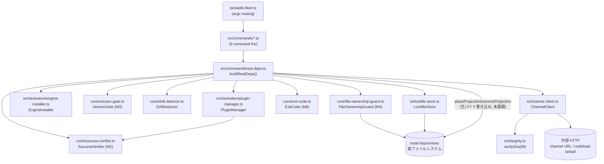
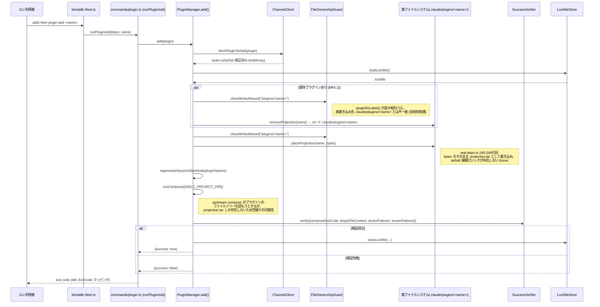
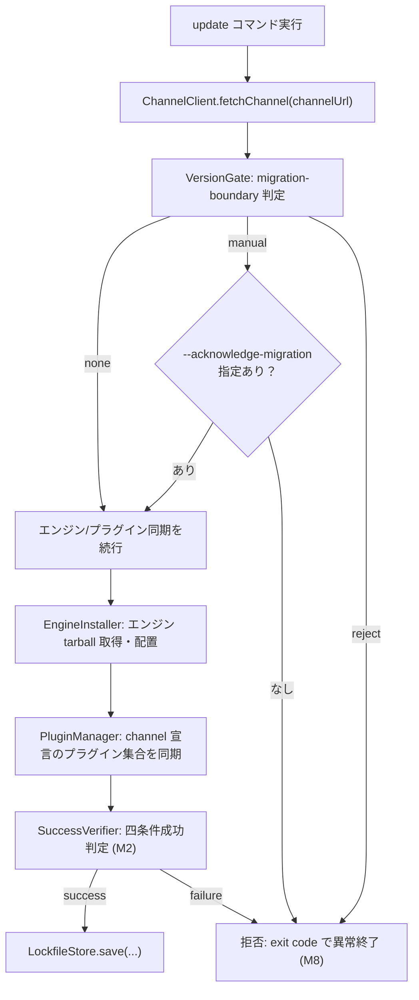

# アーキテクチャ分析

## システム概要

`aidlc-fleet-cli` は単一バイナリの CLI アプリケーションであり、外部
ネットワークサービスは持たない。エントリポイント `bin/aidlc-fleet.ts`
が argv をルーティングし、9 個のコマンド関数（`init`/`update`/`check`/
`plugin add`/`plugin remove`/`pin`/`unpin`/`status`/`doctor`、7 系統の
サブコマンド）へ委譲する。各コマンドは `src/commands/real-deps.ts` の
`buildRealDeps()` が組み立てる依存性注入コンテナ（`CommandDeps`）を
受け取って実行される。

## アーキテクチャスタイル

**レイヤードモノリス**（単一プロセス CLI、内部 3 層分離）。
team.md の「レイヤー分離」規約どおり、以下の 3 層に明確に分かれている:

1. **コマンド層**（`src/commands/*.ts`） — 引数パースと exit code 決定
   のみを担当。`bin/aidlc-fleet.ts` がルーティングし、`argv.ts` が
   パースユーティリティを提供する。
2. **コアロジック層**（`src/core/*.ts`） — `VersionGate`（M3）、
   `SuccessVerifier`（M2 四条件成功判定）、`DriftDetector`、
   `ExitCode` マッピング。原則としてファイル I/O を行わない
   （唯一の例外が `FileOwnershipGuard` — 実ファイルシステムの検査自体
   が責務のため、意図的に I/O を持つとコード内コメントで明記されている）。
3. **I/O・オーケストレーション層**（`src/io/*.ts`, `src/orchestration/*.ts`）
   — `ChannelClient`（唯一のネットワーク I/O 所有者）、
   `LockfileStore`（ロックファイルの読み書き）、`Integrity`
   （sha256 検証）、`EngineInstaller`/`PluginManager`（エンジン/プラグイン
   の配置・削除・compose 実行のオーケストレーション、ポートインターフェース
   経由で `real-deps.ts` から注入される具体的な I/O クロージャに依存）。

`real-deps.ts` はこれら 3 層を実体のクロージャで結線する「統合グルー層」
であり、`buildRealDeps()` の返り値（`CommandDeps`）がコマンド層に渡る。

## コンポーネント関係

## Interaction Diagrams

### `plugin add <name>` の実行フロー（issue #5 の核心を含む）

### `update` の実行フロー（バージョンゲート M3 を含む）

## データフロー

1. 環境変数（`AIDLC_FLEET_CHANNEL_URL`, `AIDLC_FLEET_COMPOSE_CMD`,
   `AIDLC_FLEET_DOCTOR_CMD`, `AIDLC_FLEET_ENGINE_REPO`）から実行時設定を
   取得する（`bin/aidlc-fleet.ts`）。
2. `ChannelClient.fetchChannel` が channel 宣言（エンジンバージョン、
   プラグイン集合）を HTTP 経由で取得し、`parseChannel` でスキーマ検証
   する。
3. `ChannelClient.fetchTarball` が `buildTarballUrl`（GitHub codeload
   アーカイブ規約 `https://codeload.github.com/${repo}/tar.gz/${ref}`）
   で構築した URL から tarball を取得し、`verifySha256` で整合性を検証
   した生バイト列（`Uint8Array`）を返す。
4. `EngineInstaller`/`PluginManager` が `FileOwnershipGuard` で書き込み
   可否を検査し、検証済みバイト列を `.claude/` 配下へ配置する
   （**エンジンは明示的にステージング書き込みのみと設計されているが、
   プラグインは展開されるべきところ、実装は同じ生バイト書き込みに
   留まっている — issue #5**）。
5. upstream の `compose` コマンドをサブプロセスとして実行し、その
   exit code と drops ファイル内容、`doctor` の失敗リストを
   `SuccessVerifier` が四条件判定（M2）する。
6. 成功時のみ `LockfileStore.save()` でロックファイルへ結果を永続化する。

## 主要な設計判断

- **ポートインターフェース経由の依存性注入**（`PluginManagerPorts`,
  `EngineInstaller` の同種インターフェース） — コアオーケストレーション
  ロジックをファイルシステム/ネットワーク/子プロセスから切り離し、
  モックポートによる単体テストを可能にしている。
- **ランタイム依存ゼロ** — `dependencies` フィールドなし。`fetch`
  はグローバル組み込み（bun 標準）を使用。
- **fail-fast なファイル所有権検査** — `FileOwnershipGuard` は違反を
  検知すると即座に例外を投げる（M4, project.md Forbidden/Mandated）。
- **エンジンとプラグインの非対称な設計意図** — `EngineInstaller.placeEngine`
  は「tarball 展開は upstream の仕事」という明示コメント付きでステージ
  ング書き込みに留める設計が明確だが、`PluginManager` 側の
  `placeProjection`/`removeProjection` には同様の注記がなく、展開責務が
  実装から欠落している（後述 Improvement Opportunities）。

## 改善機会

1. **`placeProjection`/`removeProjection` の tarball 展開実装**
   （issue #5 の core bug）。ランタイム依存ゼロ方針との両立要検討。
2. **`pluginDirLabel()` と実書き込み先パスの統一** — `FileOwnershipGuard`
   が実際に正しいディレクトリのシンボリックリンクを検査できるようにする。
3. **`EngineInstaller`/`PluginManager` 間の設計意図の明文化** — どちらが
   「展開責務」を持つかをコードコメントで一貫させる。
