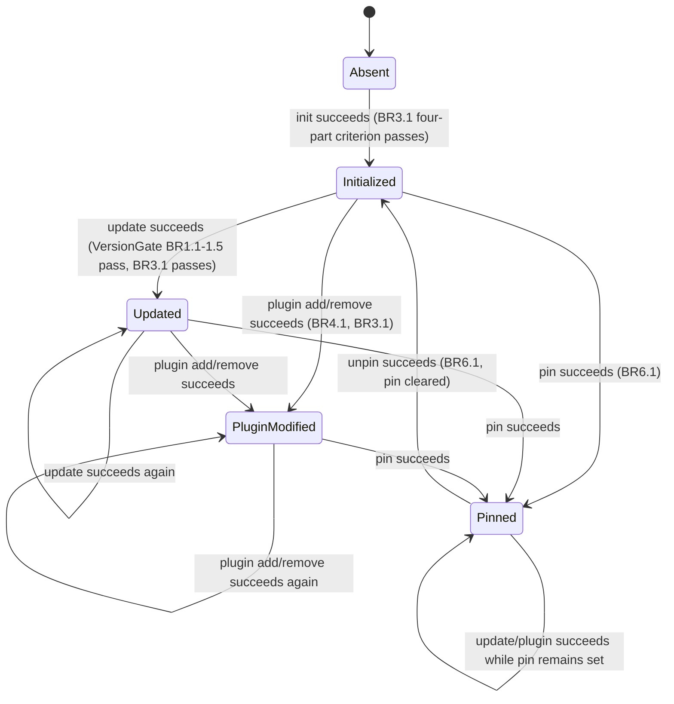
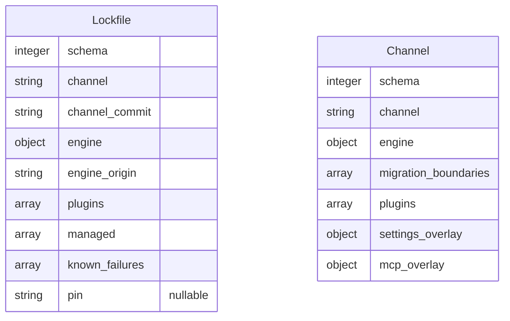

# Functional Specification — aidlc-fleet Distribution CLI

This is the source of truth for workflows (numbered step sequences) and
state machines (the Lockfile lifecycle). `entities.md` and `rules.md` do
not capture ordered behaviour or transitions — this file does. It also
carries two derived views for readability: an entity-relationship diagram
(derived from `entities.md`) and a rules summary (derived from
`rules.md`).

## Command Workflows

### `init`

1. `CommandLayer` parses argv; validates flags (`--adopt`, harness selection).
2. `CommandLayer` invokes `ChannelClient` to fetch the channel declaration.
3. `ChannelClient` downloads the channel file, then the declared engine
   tarball; verifies sha256 against the channel's declared hash (BR7.1).
   On mismatch: hard failure, stop here.
4. `CommandLayer` invokes `EngineInstaller`. No `VersionGate` check on
   first `init` (the gate only applies to `update`).
5. `EngineInstaller` invokes `FileOwnershipGuard` before placing the
   engine (BR2.1–BR2.4); on any invariant violation, fail fast (BR2.6).
6. `EngineInstaller` places the engine (install.ts wrapper for Cursor,
   receipt-diff elsewhere), re-runs compose.
7. `EngineInstaller` invokes `SuccessVerifier`; the four-part criterion
   must pass (BR3.1–BR3.4) before proceeding.
8. `EngineInstaller` writes `engine_origin` and installed-engine metadata
   via `LockfileStore` — this is the Lockfile's **creation** transition
   (see State Machine below).
9. If `--adopt` was passed, `LockfileStore` records the adoption marker
   consumed later by BR1.5.
10. `CommandLayer` maps the outcome to an exit code (0 success / 1
    partial-success-with-known-issues / 2 failure, per the exit-code
    contract, M8).

### `update`

1. `CommandLayer` parses argv; validates `--acknowledge-migration` if present.
2. `CommandLayer` invokes `ChannelClient` to fetch the current channel
   declaration (same integrity rule as `init`, BR7.1).
3. `CommandLayer` invokes `VersionGate`.
4. `VersionGate` reads `engine_origin` and `pin` from `LockfileStore`
   (BR1.4 — a pin overrides the channel's resolved latest target).
5. `VersionGate` reads `migration_boundaries` from the fetched channel and
   classifies the crossing: reject (BR1.1, hard stop) / manual (BR1.2,
   requires `--acknowledge-migration`) / none (BR1.3, proceeds).
6. If the project is adopted and this is its first update, `VersionGate`
   requires the BR1.5 precondition (`init --adopt` already recorded).
7. On gate pass, `CommandLayer` invokes `EngineInstaller` — the remaining
   steps mirror `init` steps 5–8 (invariant checks, placement, recompose,
   four-part verification), but this is a Lockfile **update** transition,
   not creation.
8. `CommandLayer` maps the outcome to an exit code (M8).

### `check`

1. `CommandLayer` parses argv (no mutating flags — `check` never writes).
2. `CommandLayer` invokes `DriftDetector`.
3. `DriftDetector` reads `LockfileStore` state (`channel_commit`, `engine`,
   `plugins`, `pin`) and `ChannelClient`'s current channel declaration
   (BR5.1). If `pin` is set, the pinned ref substitutes for the channel's
   latest in the comparison (BR5.3).
4. `DriftDetector` compares against what is actually installed on disk.
5. `DriftDetector` classifies the outcome: 0 (in sync) / 1 (behind
   channel) / 2 (local modification drift) — BR5.2.
6. `CommandLayer` exits with that code directly (M8) — `check` performs
   no writes and no Lockfile transition.

### `plugin add <name>`

1. `CommandLayer` parses argv; validates the plugin name against the
   channel's declared `plugins[]`.
2. `CommandLayer` invokes `ChannelClient` to fetch the plugin's projection
   tarball; sha256-verified (BR7.1).
3. `CommandLayer` invokes `PluginManager`.
4. `PluginManager` checks for an existing projection of this plugin; if
   one exists, removes it completely before placing the new one (BR4.1 —
   never mix versions).
5. `PluginManager` invokes `FileOwnershipGuard` before placement
   (BR2.1–BR2.4).
6. `PluginManager` places the new projection, runs compose with
   `AIDLC_PROJECT_DIR` set and stdin closed.
7. `PluginManager` regenerates the sessionStart hook wrapper (BEGIN/END
   marker merge) to include this plugin.
8. `PluginManager` invokes `SuccessVerifier` (BR3.1–BR3.4, including the
   BR3.3 plugin-sync-exit-1 classification).
9. `PluginManager` writes `plugins[]` and `engine_version_at_compose` via
   `LockfileStore` — a Lockfile **update** transition.
10. `CommandLayer` maps the outcome to an exit code (M8).

### `plugin remove <name>`

1. `CommandLayer` parses argv; validates the plugin is currently placed
   (per `LockfileStore.plugins[]`).
2. `CommandLayer` invokes `PluginManager`.
3. `PluginManager` invokes `FileOwnershipGuard` before removal — a
   removal is still a mutating operation subject to BR2.1–BR2.5 (e.g.
   BR2.5's "never auto-delete outside the receipt" applies to what gets
   removed, not just what gets added).
4. `PluginManager` removes the plugin's projection and updates the
   sessionStart hook wrapper (removes this plugin's BEGIN/END block).
5. `PluginManager` re-runs compose.
6. `PluginManager` invokes `SuccessVerifier`.
7. `PluginManager` writes the updated `plugins[]` via `LockfileStore` —
   Lockfile **update** transition.
8. `CommandLayer` maps the outcome to an exit code (M8).

### `pin <ref>` / `unpin`

1. `CommandLayer` parses argv (a ref string for `pin`; no argument for
   `unpin`).
2. `CommandLayer` invokes `LockfileStore` directly — no `ChannelClient`,
   `EngineInstaller`, or `PluginManager` involvement; this is the
   lightest-weight command in the CLI.
3. `LockfileStore` applies BR6.1: `pin <ref>` sets `Lockfile.pin = <ref>`;
   `unpin` sets `Lockfile.pin = null`. This is a Lockfile **update**
   transition (the `pin` field only).
4. `CommandLayer` maps the outcome to an exit code (M8) — a successful
   pin/unpin is 0; an invalid ref format is rejected before the write.

### `status`

1. `CommandLayer` parses argv (read-only, no mutating flags).
2. `CommandLayer` invokes `LockfileStore` for the current declared state
   and `DriftDetector` for the drift summary (S3 — reuses BR5.1–BR5.3's
   comparison, but reports rather than exits on it).
3. `CommandLayer` composes a human-readable summary: channel, installed
   engine version, plugin list, pin state (if any), and drift status.
4. `CommandLayer` exits 0 (status itself never fails on drift — drift is
   reported content, not a status-command failure condition; only a
   genuinely broken/missing Lockfile — BR8.1 — would cause a non-zero
   exit here).

### `doctor`

1. `CommandLayer` parses argv.
2. `CommandLayer` invokes `SuccessVerifier`'s doctor-wrap behaviour.
3. `SuccessVerifier` runs upstream `doctor`, reads `known_failures` from
   `LockfileStore`, and filters them out of the reported failure count
   (BR3.4).
4. `CommandLayer` exits per the filtered result (M8) — a Lockfile
   **read-only** access, no transition.

## Lockfile State Machine

Note: `Absent` is not a Lockfile *instance* state — it is the precondition
`init` requires and every other command's BR8.1 hard-failure trigger.
`check`, `status`, and `doctor` are read-only and never move the Lockfile
between these states; they are omitted from the diagram as non-transitions.

## Entity-Relationship Diagram (derived from entities.md)

No relationship line connects the two entities — per Q2 and
`entities.md`'s Entity Set Summary, `VersionGate` and `DriftDetector`
compare their fields at runtime; neither entity holds a reference to the
other.

## Rules Summary (derived from rules.md)

23 rules across 8 owning components: VersionGate (5), FileOwnershipGuard
(6), SuccessVerifier (4), PluginManager (1), DriftDetector (3),
LockfileStore (2, including the `pin` rule BR6.1 and the `AI8.1`... see
`rules.md` for the full table), ChannelClient (2). See `rules.md`'s Rules
Summary table for the complete, authoritative list — this is a pointer,
not a duplicate.

## Edge Cases and Error Handling

- **Network failure mid-fetch** (`ChannelClient`): not a business rule
  addressed by this stage — deferred to Functional Design's owning
  contract's Open Question (`contract-summary.md`), which explicitly
  defers transport-level retry tuning to this stage's *implementation*,
  i.e. Code Generation. This spec's workflows assume the fetch either
  completes with a verified hash (BR7.1) or fails outright; retry policy
  is an implementation detail layered under that assumption.
- **Concurrent invocation** (two CLI processes racing on the same
  Lockfile): not covered by any v0.1 section or approved artifact; no
  rule in `rules.md` addresses file locking. This is a genuine gap,
  carried forward as an open item for Code Generation rather than
  invented here (per the phase guardrail against inventing missing
  artifact content).
- **Partial write interruption** (process killed mid-placement): BR2.1's
  backup-before-force-replace is the only documented mitigation; no
  rule specifies transactional/atomic write semantics for the Lockfile
  itself — also carried forward as an open item.

## Open Questions

| Question | Blocks |
|----------|--------|
| Concurrent-invocation file locking for `aidlc.lock.json` | Code Generation |
| Atomic/transactional write semantics for Lockfile writes under interruption | Code Generation |
