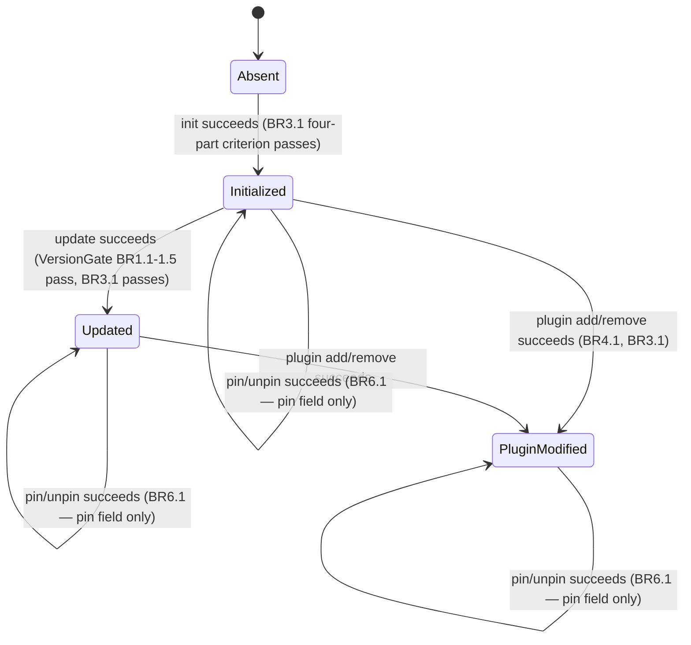
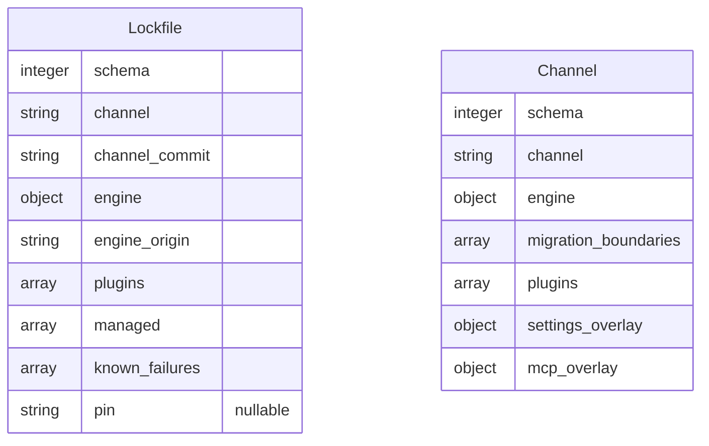

# Functional Specification — aidlc-fleet Distribution CLI

This is the source of truth for workflows (numbered step sequences) and
state machines (the Lockfile lifecycle). `entities.md` and `rules.md` do
not capture ordered behaviour or transitions — this file does. It also
carries two derived views for readability: an entity-relationship diagram
(derived from `entities.md`) and a rules summary (derived from
`rules.md`).

Note on `components.md`'s `CommandLayer → FileOwnershipGuard` edge
("invoke invariant checks around any mutating command"): none of the
workflows below has `CommandLayer` invoke `FileOwnershipGuard` directly —
every actual invocation flows through `EngineInstaller` or
`PluginManager` (both of which have their own approved edges to
`FileOwnershipGuard`). This satisfies the declared dependency
indirectly, not literally; it is called out once here so it does not
need re-litigating per workflow below.

## Command Workflows

### `init`

1. `CommandLayer` parses argv; validates flags (`--adopt`, harness selection).
2. `CommandLayer` invokes `ChannelClient` to fetch the channel declaration.
3. `ChannelClient` downloads the channel file, then the declared engine
   tarball; verifies sha256 against the channel's declared hash (BR7.1).
   On mismatch: hard failure, stop here.
4. `CommandLayer` invokes `EngineInstaller`. No `VersionGate` check on
   first `init` (the gate only applies to `update`).
5. `EngineInstaller` invokes `FileOwnershipGuard` before placing the
   engine (BR2.1–BR2.4); on any invariant violation, fail fast (BR2.6).
6. `EngineInstaller` places the engine (install.ts wrapper for Cursor,
   receipt-diff elsewhere), re-runs compose.
7. `EngineInstaller` invokes `SuccessVerifier`; the four-part criterion
   must pass (BR3.1–BR3.4) before proceeding.
8. `EngineInstaller` writes `engine_origin` and installed-engine metadata
   via `LockfileStore` — this is the Lockfile's **creation** transition
   (see State Machine below).
9. If `--adopt` was passed, `LockfileStore` records the adoption marker
   consumed later by BR1.5.
10. `CommandLayer` maps the outcome to an exit code per the canonical
    0/1/2/3/4 contract (`intent-statement.md`, v0.1 §8, M8): `0` on
    success; `4` if `SuccessVerifier`'s four-part criterion (BR3.1) fails
    (compose degraded / engine install incomplete). Codes `1`/`2` are
    drift-comparison outcomes (BR5.2) and `3` is a version-gate rejection
    (BR1.1/BR1.2) — neither applies to `init`, which performs no drift
    comparison and no gate check.

### `update`

1. `CommandLayer` parses argv; validates `--acknowledge-migration` if present.
2. `CommandLayer` invokes `ChannelClient` to fetch the current channel
   declaration (same integrity rule as `init`, BR7.1).
3. `CommandLayer` invokes `VersionGate`.
4. `VersionGate` reads `engine_origin` and `pin` from `LockfileStore`
   (BR1.4 — a pin overrides the channel's resolved latest target).
5. `VersionGate` reads `migration_boundaries` from the fetched channel and
   classifies the crossing: reject (BR1.1, hard stop) / manual (BR1.2,
   requires `--acknowledge-migration`) / none (BR1.3, proceeds).
6. If the project is adopted and this is its first update, `VersionGate`
   requires the BR1.5 precondition (`init --adopt` already recorded).
7. On gate pass, `CommandLayer` invokes `EngineInstaller` — the remaining
   steps mirror `init` steps 5–8 (invariant checks, placement, recompose,
   four-part verification), but this is a Lockfile **update** transition,
   not creation.
8. `CommandLayer` maps the outcome to an exit code per the canonical
   0/1/2/3/4 contract (M8): `0` on success; `3` if `VersionGate` rejects
   the transition (BR1.1 reject boundary, BR1.2 manual boundary without
   `--acknowledge-migration`, or BR1.5's adoption precondition unmet); `4`
   if the gate passes but `SuccessVerifier`'s four-part criterion (BR3.1)
   subsequently fails. Codes `1`/`2` (drift outcomes, BR5.2) do not apply
   to `update`.

### `check`

1. `CommandLayer` parses argv (no mutating flags — `check` never writes).
2. `CommandLayer` invokes `DriftDetector`.
3. `DriftDetector` reads `LockfileStore` state (`channel_commit`, `engine`,
   `plugins`, `pin`) and `ChannelClient`'s current channel declaration
   (BR5.1). If `pin` is set, the pinned ref substitutes for the channel's
   latest in the comparison (BR5.3).
4. `DriftDetector` compares against what is actually installed on disk.
5. `DriftDetector` classifies the outcome: 0 (in sync) / 1 (behind
   channel) / 2 (local modification drift) — BR5.2.
6. `CommandLayer` exits with that code directly (M8) — `check` performs
   no writes and no Lockfile transition.

### `plugin add <name>`

1. `CommandLayer` parses argv; validates the plugin name against the
   channel's declared `plugins[]`.
2. `CommandLayer` invokes `PluginManager`.
3. `PluginManager` invokes `ChannelClient` to fetch the plugin's
   projection tarball; sha256-verified (BR7.1) — per `components.md`'s
   approved `PluginManager → ChannelClient` edge ("fetch plugin
   projections"), not a `CommandLayer → ChannelClient` call.
4. `PluginManager` checks for an existing projection of this plugin; if
   one exists, removes it completely before placing the new one (BR4.1 —
   never mix versions).
5. `PluginManager` invokes `FileOwnershipGuard` before placement
   (BR2.1–BR2.4).
6. `PluginManager` places the new projection, runs compose with
   `AIDLC_PROJECT_DIR` set and stdin closed.
7. `PluginManager` regenerates the sessionStart hook wrapper (BEGIN/END
   marker merge) to include this plugin.
8. `PluginManager` invokes `SuccessVerifier` (BR3.1–BR3.4, including the
   BR3.3 plugin-sync-exit-1 classification).
9. `PluginManager` writes `plugins[]` and `engine_version_at_compose` via
   `LockfileStore` — a Lockfile **update** transition.
10. `CommandLayer` maps the outcome to an exit code per the canonical
    0/1/2/3/4 contract (M8): `0` on success; `4` if BR3.1's four-part
    criterion fails. No `VersionGate` involvement, so `3` does not apply;
    `1`/`2` (drift outcomes) do not apply either.

### `plugin remove <name>`

1. `CommandLayer` parses argv; validates the plugin is currently placed
   (per `LockfileStore.plugins[]`).
2. `CommandLayer` invokes `PluginManager`.
3. `PluginManager` invokes `FileOwnershipGuard` before removal — a
   removal is still a mutating operation subject to BR2.1–BR2.5 (e.g.
   BR2.5's "never auto-delete outside the receipt" applies to what gets
   removed, not just what gets added).
4. `PluginManager` removes the plugin's projection and updates the
   sessionStart hook wrapper (removes this plugin's BEGIN/END block).
5. `PluginManager` re-runs compose.
6. `PluginManager` invokes `SuccessVerifier`.
7. `PluginManager` writes the updated `plugins[]` via `LockfileStore` —
   Lockfile **update** transition.
8. `CommandLayer` maps the outcome to an exit code per the canonical
   0/1/2/3/4 contract (M8): `0` on success; `4` if BR3.1's four-part
   criterion fails. No `VersionGate` involvement, so `3` does not apply;
   `1`/`2` (drift outcomes) do not apply either.

### `pin <ref>` / `unpin`

1. `CommandLayer` parses argv (a ref string for `pin`; no argument for
   `unpin`).
2. `CommandLayer` invokes `LockfileStore` directly — no `ChannelClient`,
   `EngineInstaller`, or `PluginManager` involvement; this is the
   lightest-weight command in the CLI.
3. `LockfileStore` applies BR6.1: `pin <ref>` sets `Lockfile.pin = <ref>`;
   `unpin` sets `Lockfile.pin = null`. This is a Lockfile **update**
   transition (the `pin` field only).
4. `CommandLayer` maps the outcome to an exit code (M8) — a successful
   pin/unpin is 0; an invalid ref format is rejected before the write.

### `status`

1. `CommandLayer` parses argv (read-only, no mutating flags).
2. `CommandLayer` invokes `LockfileStore` for the current declared state
   and `DriftDetector` for the drift summary (S3 — reuses BR5.1–BR5.3's
   comparison, but reports rather than exits on it).
3. `CommandLayer` composes a human-readable summary: channel, installed
   engine version, plugin list, pin state (if any), and drift status.
4. `CommandLayer` exits 0 (status itself never fails on drift — drift is
   reported content, not a status-command failure condition; only a
   genuinely broken/missing Lockfile — BR8.1 — would cause a non-zero
   exit here).

### `doctor`

1. `CommandLayer` parses argv.
2. `CommandLayer` invokes `SuccessVerifier`'s doctor-wrap behaviour.
3. `SuccessVerifier` runs upstream `doctor`, reads `known_failures` from
   `LockfileStore`, and filters them out of the reported failure count
   (BR3.4).
4. `CommandLayer` exits per the filtered result (M8) — a Lockfile
   **read-only** access, no transition.

## Lockfile State Machine

Note: `Absent` is not a Lockfile *instance* state — it is the precondition
`init` requires and every other command's BR8.1 hard-failure trigger.
`check`, `status`, and `doctor` are read-only and never move the Lockfile
between these states; they are omitted from the diagram as non-transitions.
`pin`/`unpin` are modeled as self-transitions on whichever of
`Initialized`/`Updated`/`PluginModified` the project is currently in, not
as a separate `Pinned` state: per BR6.1, pin/unpin touches only the `pin`
field and leaves `engine_origin`, `engine`, and `plugins[]` — the fields
that actually distinguish these three states — untouched. An earlier
version of this diagram routed every `unpin` back to `Initialized`
regardless of prior state, silently erasing `Updated`/`PluginModified`
history that BR6.1 never asked to erase; this revision fixes that.
Whether the pin override is currently set is a Lockfile *attribute*
(`pin: string | null`, per `entities.md`), not a distinct lifecycle state.

## Entity-Relationship Diagram (derived from entities.md)

No relationship line connects the two entities — per Q2 and
`entities.md`'s Entity Set Summary, `VersionGate` and `DriftDetector`
compare their fields at runtime; neither entity holds a reference to the
other.

## Rules Summary (derived from rules.md)

23 rules across 7 owning components: VersionGate (5), FileOwnershipGuard
(6), SuccessVerifier (4), PluginManager (1), DriftDetector (3),
LockfileStore (2, the `pin` rule BR6.1 and BR8.1), ChannelClient (2). See
`rules.md`'s Rules Summary table for the complete, authoritative list —
this is a pointer, not a duplicate.

## Edge Cases and Error Handling

- **Network failure mid-fetch** (`ChannelClient`): not a business rule
  addressed by this stage — deferred to Functional Design's owning
  contract's Open Question (`contract-summary.md`), which explicitly
  defers transport-level retry tuning to this stage's *implementation*,
  i.e. Code Generation. This spec's workflows assume the fetch either
  completes with a verified hash (BR7.1) or fails outright; retry policy
  is an implementation detail layered under that assumption.
- **Concurrent invocation** (two CLI processes racing on the same
  Lockfile): not covered by any v0.1 section or approved artifact; no
  rule in `rules.md` addresses file locking. This is a genuine gap,
  carried forward as an open item for Code Generation rather than
  invented here (per the phase guardrail against inventing missing
  artifact content).
- **Partial write interruption** (process killed mid-placement): BR2.1's
  backup-before-force-replace is the only documented mitigation; no
  rule specifies transactional/atomic write semantics for the Lockfile
  itself — also carried forward as an open item.

## Open Questions

| Question | Blocks |
|----------|--------|
| Concurrent-invocation file locking for `aidlc.lock.json` | Code Generation |
| Atomic/transactional write semantics for Lockfile writes under interruption | Code Generation |

## Revision Note (post iteration-1 NOT-READY)

Per the architecture reviewer's iteration-1 findings (R-01 Critical,
R-02/R-03/R-04 Major, R-05/R-06/R-07/R-08 Minor):

- **R-01 fix**: every command's exit-code mapping now uses the canonical
  0/1/2/3/4 contract from `intent-statement.md` — `3` for VersionGate
  rejection, `4` for a SuccessVerifier four-part-criterion failure — in
  place of the invented "partial-success/failure" 1/2 gloss.
- **R-02 fix**: `plugin add`'s tarball fetch now happens inside the
  `PluginManager` invocation, matching `components.md`'s approved
  `PluginManager → ChannelClient` edge, not `CommandLayer → ChannelClient`.
- **R-03 fix**: the Lockfile state machine models `pin`/`unpin` as
  self-transitions on the current state (per BR6.1's narrow "pin field
  only" effect) instead of routing every `unpin` back to `Initialized`.
- **R-04 fix**: `rules.md`'s BR3.1 `logic` is now a genuine 3-predicate
  boolean AND; BR3.3's plugin-sync classification is cross-referenced
  separately rather than folded in as an unimplementable fourth conjunct.
- **R-05 fix**: added a note that `CommandLayer → FileOwnershipGuard` is
  satisfied indirectly (via `EngineInstaller`/`PluginManager`), not by a
  direct call in any workflow.
- **R-06 fix**: corrected "8 owning components" to "7" in the Rules Summary.
- **R-07 fix**: corrected the garbled `AI8.1` rule ID to `BR8.1`.
- **R-08 fix**: `traceability.json`'s M5 coverage now targets
  `BR1.1, BR1.2, BR1.3, BR1.5` instead of just `BR1.1`.

## Review

**Verdict:** READY
**Reviewer:** aidlc-architecture-reviewer-agent
**Date:** 2026-09-08T14:59:08Z
**Iteration:** 2

### Findings

| ID | Severity | Location | Finding | Required action | Status |
|---|---|---|---|---|---|
| R-01 | Critical | functional-spec.md > exit-code mapping, all command workflows | Re-derived the canonical exit-code contract from `intent-statement.md` (`0`=in sync, `1`=behind channel, `2`=local mod drift, `3`=version-gate rejection, `4`=compose degraded/install incomplete) and confirmed every workflow's mapping (init/update/check/plugin add/plugin remove/pin/unpin/status/doctor) now uses exactly this contract with no invented codes. | None — resolved. | Resolved |
| R-02 | Major | functional-spec.md > `plugin add` workflow step 3 | Confirmed `components.md` line 328 declares `PluginManager --> ChannelClient` and `PluginManager`'s `depends_on` includes `ChannelClient`; the workflow now invokes the fetch from inside `PluginManager`, matching the approved edge — no `CommandLayer --> ChannelClient` call remains in this workflow. | None — resolved. | Resolved |
| R-03 | Major | functional-spec.md > Lockfile State Machine | Confirmed `rules.md` BR6.1 scopes pin/unpin to the `pin` field only ("pin persists a per-project override into the Lockfile; unpin clears it"); the diagram now models pin/unpin as self-transitions on `Initialized`/`Updated`/`PluginModified` instead of routing `unpin` back to `Initialized`, so `Updated`/`PluginModified` history is no longer silently erased. | None — resolved. | Resolved |
| R-04 | Major | rules.md > BR3.1 `logic` field | BR3.1's logic is now a genuine 3-predicate boolean AND (compose exit 0 AND no `[degraded]` line AND doctor-count-minus-known-failures == 0); BR3.3's plugin-sync-exit-1 reclassification is cross-referenced as a separate, independently-applied rule rather than ANDed in as an unimplementable fourth boolean conjunct. | None — resolved. | Resolved |
| R-05 | Minor | functional-spec.md > header note (lines 10-17) | `components.md`'s `CommandLayer --> FileOwnershipGuard` edge is still never exercised directly in any workflow, but the spec now states this explicitly and explains the edge is satisfied indirectly via `EngineInstaller`/`PluginManager` (both of which have their own approved edges to `FileOwnershipGuard`), so the gap is no longer silent. | None — resolved. | Resolved |
| R-06 | Minor | functional-spec.md > Rules Summary | Recounted `rules.md`: VersionGate(5)+FileOwnershipGuard(6)+SuccessVerifier(4)+PluginManager(1)+DriftDetector(3)+LockfileStore(2)+ChannelClient(2) = 23 rules across 7 components, matching the corrected text. | None — resolved. | Resolved |
| R-07 | Minor | functional-spec.md > Lockfile State Machine note | The garbled `AI8.1` reference is now correctly `BR8.1`, matching `rules.md`'s actual rule ID. | None — resolved. | Resolved |
| R-08 | Minor | traceability.json > coverage[M5] | Cross-checked `intent-backlog.md`: M5 is "`update`, gated by M3" and M3 (the version gate) covers BR1.1-BR1.5. `traceability.json` now targets `BR1.1, BR1.2, BR1.3, BR1.5` for M5 (the update-time gating rules), a materially fuller citation than the prior BR1.1-only target. | None — resolved. | Resolved |

No new defects were found on a fresh scan of the edited sections (mermaid `stateDiagram-v2` and `erDiagram` blocks both parse cleanly; the exit-code prose is internally consistent across all seven command workflows; `entities.md`'s `Lockfile.pin` attribute and `rules.md`'s BR6.1/BR8.1 wording were re-checked against the revised text and agree).

### Validation Tool Results

| Tool | Result | Interpretation |
|---|---|---|
| Manual cross-reference: exit-code contract vs. intent-statement.md v0.1 §8 | PASS | All workflows map to 0/1/2/3/4 exactly as specified; no invented codes remain |
| Manual cross-reference: components.md depends_on/dependents edges vs. functional-spec.md workflow steps | PASS | Every component-to-component call in every workflow matches a declared edge in components.md |
| Manual cross-reference: rules.md BR6.1/BR3.1/BR8.1 vs. functional-spec.md and rules.md prose | PASS | State machine, boolean logic, and rule-ID reference all agree with rules.md's actual text |
| Manual cross-reference: traceability.json M5 vs. intent-backlog.md M3/M5 | PASS | M5 target is a defensible subset of M3's gating rules (BR1.1/1.2/1.3/1.5) |

### Summary

All eight iteration-1 findings are verified fixed against the current file contents and the same upstream artifacts (`intent-statement.md`, `components.md`, `rules.md`, `intent-backlog.md`) used in the prior review; no new defects were introduced by the edits. The design is implementable as written.
