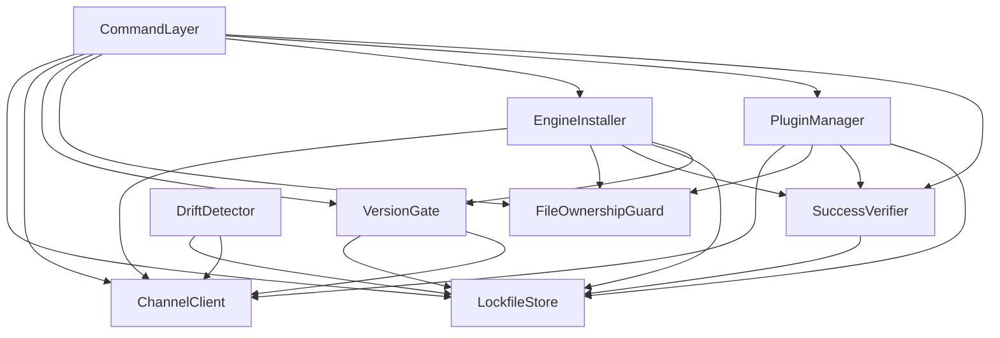

# Component Catalogue — aidlc-fleet Distribution CLI

## Component Catalogue (machine-readable)

```yaml
components:
  - name: CommandLayer
    summary: Argument parsing and exit-code determination for all seven CLI commands.
    behaviour: >
      Parses argv for init/update/check/plugin/pin/unpin/status/doctor, validates
      flag combinations, dispatches to the owning component, and maps the result
      to the exit-code contract (0/1/2/3/4, v0.1 §8). Contains no business logic
      of its own — a pure routing/exit-code layer per the team's mandated layer
      separation.
    responsibilities:
      - CLI argument parsing and validation
      - Command dispatch to the owning component
      - Exit-code mapping (0/1/2/3/4)
    depends_on:
      - component: LockfileStore
        interaction: read current state for status/check
        style: sync
      - component: ChannelClient
        interaction: trigger channel fetch for init/update
        style: sync
      - component: VersionGate
        interaction: invoke migration-boundary check for update
        style: sync
      - component: FileOwnershipGuard
        interaction: invoke invariant checks around any mutating command
        style: sync
      - component: EngineInstaller
        interaction: invoke engine placement for init/update
        style: sync
      - component: PluginManager
        interaction: invoke plugin add/remove/pin/unpin
        style: sync
      - component: SuccessVerifier
        interaction: invoke the four-part success check and doctor wrapping
        style: sync
      - component: DriftDetector
        interaction: invoke three-way drift comparison for check/status
        style: sync
    dependents: []
    external_dependencies: []
    entities: []

  - name: LockfileStore
    summary: Reads and writes the project's aidlc.lock.json — the single source of on-disk project state, including the per-project pin override.
    behaviour: >
      Owns all reads and writes to aidlc.lock.json. Provides typed accessors for
      channel, channel_commit, engine metadata, engine_origin, plugins[], managed
      marker identifiers, known_failures[], and the per-project pin override
      (pin/unpin). Never performs network I/O or filesystem mutation outside its
      own lockfile.
    responsibilities:
      - Persist and load the Lockfile entity
      - Provide engine_origin read/write for the version gate
      - Provide plugins[] read/write for plugin management
      - Persist and clear the per-project pin override (pin/unpin, C1)
    depends_on: []
    dependents:
      - component: CommandLayer
        interaction: read current state for status/check
      - component: EngineInstaller
        interaction: read/write engine_origin and installed-engine metadata
      - component: PluginManager
        interaction: read/write plugins[] and engine_version_at_compose
      - component: VersionGate
        interaction: read engine_origin and pin (a pin overrides the channel's resolved ref)
      - component: SuccessVerifier
        interaction: read known_failures
      - component: DriftDetector
        interaction: read lockfile state (channel_commit, engine, plugins, pin) for comparison
    external_dependencies:
      - name: aidlc.lock.json (local filesystem)
        kind: other
        purpose: persisted project state
    entities:
      - name: Lockfile
        identifier: project path (one lockfile per project)
        attributes: [channel, channel_commit, engine, engine_origin, plugins, managed, known_failures, pin]
        references: []

  - name: DriftDetector
    summary: Compares lockfile, channel, and on-disk state to detect drift for check and status.
    behaviour: >
      Implements the three-way comparison behind `check` (M6) and the drift
      portion of `status` (S3): lockfile-declared state vs. the central
      channel's current declaration vs. what is actually installed on disk.
      Maps the comparison outcome to the exit-code contract (0=in sync,
      1=behind channel, 2=local modification drift). A pin (read via
      LockfileStore) is compared against the channel's resolved ref instead of
      the channel's latest, per VersionGate's pin-override precedence. Reads
      state only; never writes.
    responsibilities:
      - Three-way drift comparison (lockfile / channel / disk)
      - Exit-code classification for check (0/1/2)
      - Drift summary data for status (S3)
    depends_on:
      - component: LockfileStore
        interaction: read lockfile state (channel_commit, engine, plugins, pin) for comparison
        style: sync
      - component: ChannelClient
        interaction: read the channel's current declaration for comparison
        style: sync
    dependents:
      - component: CommandLayer
        interaction: invoke three-way drift comparison for check/status
    external_dependencies:
      - name: Project filesystem
        kind: other
        purpose: on-disk installed-state side of the three-way comparison
    entities: []

  - name: ChannelClient
    summary: Fetches the central channel declaration and engine/plugin tarballs, verifying integrity.
    behaviour: >
      Retrieves the channel file (git repo or static URL) and downloads
      engine/plugin tarballs from codeload.github.com, verifying sha256 against
      the channel's declared hash before handing bytes to any other component.
      Never writes to the project's own filesystem beyond a temp download area.
    responsibilities:
      - Fetch and parse the central channel declaration
      - Download and sha256-verify engine/plugin tarballs
    depends_on: []
    dependents:
      - component: CommandLayer
        interaction: trigger channel fetch for init/update
      - component: VersionGate
        interaction: read migration_boundaries from the channel
      - component: EngineInstaller
        interaction: fetch engine tarball
      - component: PluginManager
        interaction: fetch plugin projections
      - component: DriftDetector
        interaction: read the channel's current declaration for comparison
    external_dependencies:
      - name: Central channel repo or static URL
        kind: other
        purpose: source of truth for engine version and plugin set
      - name: codeload.github.com
        kind: third-party-api
        purpose: tarball download for engine/plugin sources
    entities:
      - name: Channel
        identifier: channel name/URL
        attributes: [schema, channel, engine, migration_boundaries, plugins, settings_overlay, mcp_overlay]
        references: []

  - name: VersionGate
    summary: Decides whether an update may proceed, per the origin-record migration-boundary logic.
    behaviour: >
      Pure decision component (v0.1 §4): compares a project's engine_origin
      against the target version's migration_boundaries; classifies the crossing
      as none/manual/reject; requires --acknowledge-migration to proceed past a
      manual boundary; always rejects a reject boundary; requires init --adopt
      before an adopted project's first update. A pin (read from LockfileStore)
      overrides the channel's latest resolved target — the gate then classifies
      against the pinned ref instead. Performs no I/O itself — reads are handed
      to it by CommandLayer.
    responsibilities:
      - Classify a version transition against migration_boundaries
      - Enforce the reject/manual/none gate outcomes
      - Resolve the target ref against a pin override, when present
    depends_on:
      - component: LockfileStore
        interaction: read engine_origin and pin
        style: sync
      - component: ChannelClient
        interaction: read migration_boundaries from the channel
        style: sync
    dependents:
      - component: CommandLayer
        interaction: invoke migration-boundary check for update
      - component: EngineInstaller
        interaction: gate check before proceeding with an update
    external_dependencies: []
    entities: []

  - name: FileOwnershipGuard
    summary: Enforces the file-ownership invariants and fails fast on violation.
    behaviour: >
      Checks every mutating operation against v0.1 §7: engine-owned directories
      are replaced only with --force plus a backup; settings.json/hooks.json
      merge per the defined rule (engine wins on hooks/statusLine, project wins
      elsewhere); aidlc/ workspace state is never touched except the initial
      memory seed copy; no write ever passes through a symlink; receipt-external
      files are never auto-deleted. A detected violation raises immediately
      (fail fast, Mandated per discovered-rules.md) rather than continuing.
    responsibilities:
      - Pre-write invariant checks for every mutating command
      - Fail-fast enforcement on any invariant violation
      - Backup creation before an engine-directory --force replace
    depends_on: []
    dependents:
      - component: CommandLayer
        interaction: invoke invariant checks around any mutating command
      - component: EngineInstaller
        interaction: enforce invariants during engine placement
      - component: PluginManager
        interaction: enforce invariants during plugin placement
    external_dependencies:
      - name: Project filesystem
        kind: other
        purpose: subject of the invariant checks
    entities: []

  - name: EngineInstaller
    summary: Places the engine (Cursor install.ts wrapper, or receipt-diff for other harnesses) and re-runs compose.
    behaviour: >
      For Cursor, wraps upstream dist/cursor/install.ts. For other harnesses,
      performs the receipt-diff managed-file replacement procedure (v0.1 §5.1).
      Always re-runs compose afterward regardless of harness (idempotent per
      P2). Gated by VersionGate on update; skips the gate on first init.
    responsibilities:
      - Engine placement (install.ts wrapper or receipt-diff)
      - Post-placement compose re-run
      - engine_origin declaration on first init
    depends_on:
      - component: ChannelClient
        interaction: fetch engine tarball
        style: sync
      - component: FileOwnershipGuard
        interaction: enforce invariants during engine placement
        style: sync
      - component: SuccessVerifier
        interaction: confirm the four-part success criterion after placement
        style: sync
      - component: LockfileStore
        interaction: read/write engine_origin and installed-engine metadata
        style: sync
      - component: VersionGate
        interaction: gate check before proceeding with an update
        style: sync
    dependents:
      - component: CommandLayer
        interaction: invoke engine placement for init/update
    external_dependencies:
      - name: Upstream install.ts / compose.ts
        kind: other
        purpose: canonical engine install and plugin-compose logic (never reimplemented, per §0 non-goal)
    entities: []

  - name: PluginManager
    summary: Places or removes plugin projections and regenerates the sessionStart hook wrapper.
    behaviour: >
      Fetches a plugin projection, refuses to mix versions (removes the prior
      projection before placing a new one, per P6), runs compose with
      AIDLC_PROJECT_DIR set and stdin closed, and maintains the single
      sessionStart hook wrapper script (BEGIN/END marker merge/removal) that
      iterates lockfile.plugins[] on every session start.
    responsibilities:
      - Plugin projection placement/removal with version-mixing guard
      - sessionStart hook wrapper generation and removal
    depends_on:
      - component: ChannelClient
        interaction: fetch plugin projections
        style: sync
      - component: FileOwnershipGuard
        interaction: enforce invariants during plugin placement
        style: sync
      - component: SuccessVerifier
        interaction: confirm the four-part success criterion after placement
        style: sync
      - component: LockfileStore
        interaction: read/write plugins[] and engine_version_at_compose
        style: sync
    dependents:
      - component: CommandLayer
        interaction: invoke plugin add/remove/pin/unpin
    external_dependencies: []
    entities: []

  - name: SuccessVerifier
    summary: Implements the four-part success criterion and wraps upstream doctor with known_failures filtering.
    behaviour: >
      Checks, in combination, that (1) the compose process exited 0, (2) no
      [degraded] line appears in the relevant .drops file, (3) doctor's failed
      count minus known_failures is 0, and (4) a plugin sync exit 1 is surfaced
      as "installation incomplete" rather than treated as failure (v0.1 §6,
      called out as the most important section). Compose exit 0 alone is never
      sufficient. Runs upstream doctor and filters known_failures.
    responsibilities:
      - Four-part success-criterion evaluation
      - .drops file [degraded] scanning
      - doctor wrapping with known_failures filtering
      - plugin sync exit-1-as-incomplete classification
    depends_on:
      - component: LockfileStore
        interaction: read known_failures
        style: sync
    dependents:
      - component: CommandLayer
        interaction: invoke the four-part success check and doctor wrapping
      - component: EngineInstaller
        interaction: confirm success after placement
      - component: PluginManager
        interaction: confirm success after placement
    external_dependencies:
      - name: Upstream doctor
        kind: other
        purpose: base health-check tool this component wraps and filters
    entities: []
```

## Component Diagram



## Component Summary

| Component | Purpose | Depends On | Dependents | Entities Owned |
|-----------|---------|------------|------------|-----------------|
| CommandLayer | Argument parsing, exit-code mapping, command dispatch | LockfileStore, ChannelClient, VersionGate, FileOwnershipGuard, EngineInstaller, PluginManager, SuccessVerifier, DriftDetector | — | — |
| LockfileStore | Persist/load `aidlc.lock.json`, including the pin override | — | CommandLayer, EngineInstaller, PluginManager, VersionGate, SuccessVerifier, DriftDetector | Lockfile |
| ChannelClient | Fetch central channel + tarballs, sha256-verify | — | CommandLayer, VersionGate, EngineInstaller, PluginManager, DriftDetector | Channel |
| VersionGate | Migration-boundary decision logic | LockfileStore, ChannelClient | CommandLayer, EngineInstaller | — |
| FileOwnershipGuard | Enforce file-ownership invariants, fail fast | — | CommandLayer, EngineInstaller, PluginManager | — |
| EngineInstaller | Place engine, re-run compose | ChannelClient, FileOwnershipGuard, SuccessVerifier, LockfileStore, VersionGate | CommandLayer | — |
| PluginManager | Place/remove plugins, maintain sessionStart hook | ChannelClient, FileOwnershipGuard, SuccessVerifier, LockfileStore | CommandLayer | — |
| SuccessVerifier | Four-part success criterion, doctor wrapping | LockfileStore | CommandLayer, EngineInstaller, PluginManager | — |
| DriftDetector | Three-way drift comparison for check/status | LockfileStore, ChannelClient | CommandLayer | — |

## Entity Ownership

| Entity | Owning Component | Identifier | Attributes | References |
|--------|-------------------|------------|------------|-------------|
| Lockfile | LockfileStore | project path (one per project) | channel, channel_commit, engine, engine_origin, plugins, managed, known_failures, pin | — |
| Channel | ChannelClient | channel name/URL | schema, channel, engine, migration_boundaries, plugins, settings_overlay, mcp_overlay | — |

## External Dependencies

| Component | Dependency | Kind | Purpose |
|-----------|------------|------|---------|
| LockfileStore | aidlc.lock.json (local filesystem) | other | Persisted project state |
| ChannelClient | Central channel repo or static URL | other | Source of truth for engine version and plugin set |
| ChannelClient | codeload.github.com | third-party-api | Tarball download for engine/plugin sources |
| FileOwnershipGuard | Project filesystem | other | Subject of the invariant checks |
| EngineInstaller | Upstream install.ts / compose.ts | other | Canonical engine install and plugin-compose logic (never reimplemented, per §0 non-goal) |
| SuccessVerifier | Upstream doctor | other | Base health-check tool this component wraps and filters |
| DriftDetector | Project filesystem | other | On-disk installed-state side of the three-way comparison |

## Rationale

| Component | Why a separate building block |
|-----------|-------------------------------|
| CommandLayer | Distinct concern (CLI surface) and distinct change rate (adding a flag never touches business logic); mandated by the team's layer-separation rule |
| LockfileStore | Distinct data ownership — the single source of on-disk project state, read/written by six other components |
| ChannelClient | Distinct concern (network I/O and integrity verification) and distinct external dependency surface |
| VersionGate | The CLI's single highest-risk decision (v0.1 §4); isolated so it can be unit-tested in total isolation from I/O, per the team's TDD/layer-separation mandate |
| FileOwnershipGuard | Distinct concern (data-loss prevention) that fires across every mutating command, not tied to one command's lifecycle; mandated to fail fast, requiring dedicated real-filesystem integration tests (M4) that a shared component would dilute |
| EngineInstaller | Distinct lifecycle (engine placement) and distinct external dependency (upstream install.ts / compose.ts, never reimplemented per the §0 non-goal) |
| PluginManager | Distinct lifecycle (plugin placement) and a distinct constraint (never mix plugin versions, P6) that would be an easy-to-miss special case if folded into EngineInstaller |
| SuccessVerifier | The document's own most-emphasized section (§6, "最重要"); isolated so its four-part logic can be tested independently of which command triggered it |
| DriftDetector | Distinct concern (read-only three-way comparison for `check`/`status`) with its own exit-code classification logic (0/1/2), separable from `CommandLayer`'s pure routing role and from `VersionGate`'s update-time gate decision — comparing "what is" (drift) is a different question from "may this proceed" (the gate) |

**Alternatives Rejected**: folding `EngineInstaller` and `PluginManager` into one `Installer` component was considered, since both share the ChannelClient→FileOwnershipGuard→SuccessVerifier dependency chain. Rejected because they have different triggers (init/update vs. plugin add/remove), different version-mixing rules (P6 applies only to plugins), and different lifecycles (engine install rarely repeats; plugin add/remove is expected to happen often) — folding them would create one component with two unrelated change reasons, violating "two concepts that change for different reasons belong in different components." Folding `DriftDetector`'s comparison logic into `CommandLayer` (the original R-01 shape) was also considered and rejected: `CommandLayer` is mandated to stay a pure routing/exit-code layer per the team's layer-separation rule, and burying the three-way comparison there would leave the CLI's second-most-invoked command (`check`) with no independently testable component, unlike every other piece of core logic in this catalogue.
